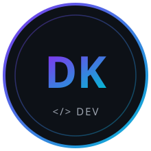
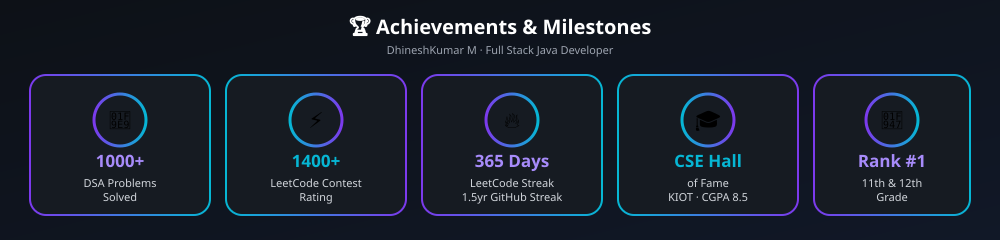

<!-- ================================================= -->
<!--            HEADER — TOKYO NIGHT THEME            -->
<!-- ================================================= -->

<p align="center">
  
</p>

<p align="center">
  
</p>

<p align="center">
  
</p>

<p align="center">
  <a href="#-about-me">About</a> ·
  <a href="#-technical-proficiency">Tech&nbsp;Stack</a> ·
  <a href="#-achievements--badges">Badges</a> ·
  <a href="#-top-7-github-projects">Top&nbsp;7&nbsp;Projects</a> ·
  <a href="#-github-analytics">GitHub&nbsp;Stats</a> ·
  <a href="#-portfolio--resume">Portfolio&nbsp;&amp;&nbsp;Resume</a>
</p>

<p align="center">
  
  
  
  
</p>

---

## 👨‍💻 About Me

```yaml
name: "DhineshKumar M"
role: "Aspiring Full Stack Java Developer · ML Engineer · AI Engineer"
education: "B.E. CSE, Knowledge Institute of Technology (KIOT) — Class of 2027"
cgpa: "8.5"
recognition: "CSE Hall of Fame @ KIOT · 1st Rank in 11th & 12th Grade"
scholarship: "Pursuing degree under 7.5% Government Scholarship quota"
focus: ["Spring Boot Backends", "System Design (LLD/HLD)", "AI/ML & GenAI", "DSA"]
currently_building: "Flipkart-style e-commerce platform (Spring Boot + MySQL + React)"
repositories: "117 public repos on GitHub"
```

> *"Knowledge is power."*

<h3 align="center">🌐 Connect With Me</h3>

<p align="center">
  <a href="https://github.com/Dhinesh-Developer"></a>
  <a href="https://www.linkedin.com/in/%E1%B4%85%CA%9C%C9%AA%C9%B4%E1%B4%87s%CA%9C%E1%B4%8B%E1%B4%9C%E1%B4%8D%E1%B4%80%CA%80-%E1%B4%8D-b75b1a283/"></a>
  <a href="https://youtube.com/@dhineshdeveloper07"></a>
  <a href="https://leetcode.com/dhineshdeveloper_07"></a>
  <a href="https://takeuforward.org/profile/Dhinesh%20Developer"></a>
  <a href="https://www.geeksforgeeks.org/user/dhineshdeveloper07/"></a>
</p>

---

## 🛠 Technical Proficiency

### 📌 Core Competencies

<p align="center">
  
  
  
  
  
  
  
  
</p>

### 🚀 Backend Engineering — Languages & Frameworks

<p align="center">
  
  
  
  
  
  
  
  
  
</p>

### 🎨 Frontend Development

<p align="center">
  
  
  
  
  
  
</p>

### 🤖 AI / Machine Learning / GenAI

<p align="center">
  
  
  
  
  
  
  
  
  
  
  
  
  
  
  
  
  
  
  
  
  
  
  
  
  
  
  
  
  
  
  
  
  
  
</p>

### 🧪 Testing & Quality (SDET)

<p align="center">
  
  
  
  
  
  
</p>

### 🗄 Databases & Data Infrastructure

<p align="center">
  
  
  
  
  
  
</p>

### ⚙️ DevOps, MLOps, Cloud & Tools

<p align="center">
  
  
  
  
  
  
  
  
  
  
  
</p>

<p align="center">
  
  
  
</p>

---

## 💼 Internships & Experience

<table align="center">
<tr>
<td width="33%" valign="top">

**🏢 NULLClass**
`Full Stack Java Intern`

- Built and shipped full-stack Java features end-to-end
- Worked across Spring Boot backend + frontend integration
- Applied REST API design and DB-backed workflows

</td>
<td width="33%" valign="top">

**🏢 LogicVeda**
`Data Scientist & ML Intern`

- Worked on data analysis and ML model development
- Applied Python data-science tooling to real datasets
- Supported model evaluation and reporting workflows

</td>
<td width="33%" valign="top">

**🏢 NoviTech R&D** — Coimbatore
`R&D Web Development` · Oct–Sep 2024

- Full-stack development within an R&D web team
- Contributed to frontend builds (React) and integration work
- Collaborated in a structured, deadline-driven dev environment

</td>
</tr>
</table>

## 🌍 Open Source Contributions

<table align="center">
<tr>
<td width="33%" valign="top">

**🌱 GirlScript Summer of Code**

Contributed to community open-source projects as part of GSSoC, working with existing codebases and collaborative PR workflows.

</td>
<td width="33%" valign="top">

**⚡ Nexus Spring of Code**

Participated as a contributor, submitting improvements and fixes to open-source repositories under program guidelines.

</td>
<td width="33%" valign="top">

**🤝 Social Summer of Code**

Contributed to socially-driven open-source initiatives, practicing Git collaboration at scale across a distributed contributor base.

</td>
</tr>
</table>

<p align="center">
  
  
  
</p>

---

## 🏆 Achievements & Badges

<p align="center">
  
</p>

<div align="center">

| Platform | Problems Solved | Streak | Ranking / Rating |
|:--:|:--:|:--:|:--:|
| **LeetCode** | 500+ | 365 Days | 1400+ Contest Rating |
| **GeeksforGeeks** | 250+ | Consistent | Institute Rank #20 |
| **Take U Forward** | 350+ | Active | SDE Sheet 80% Complete |

</div>

<p align="center">
  
  
</p>

> 📌 The graphic above is a custom-built achievements card (`assets/badges.svg`) — actual per-platform badge icons (LeetCode's "Guardian"/"Knight," TUF's sheet-completion badges) live behind each site's authenticated UI and can't be scraped or pulled via public API, so this recreates your key milestones as a designed badge row instead of leaving them out.

---

## 🗂 Top 7 GitHub Projects

<div align="center">

| # | Project | Repository | Stack | What it does |
|:-:|---|---|---|---|
| 1 | 🧾 Smart-Expense-tracker | [github.com/.../Smart-Expense-tracker](https://github.com/Dhinesh-Developer/Smart-Expense-tracker) | Spring Boot · JPA/Hibernate · MySQL · JWT | Full-stack expense & budget tracker — category-based analytics, JWT auth |
| 2 | 🚕 RideBookingApplication | [github.com/.../RideBookingApplication](https://github.com/Dhinesh-Developer/RideBookingApplication) | Java · OOP · SOLID · Design Patterns | Uber-inspired ride booking — driver assignment, fare calculation, payments |
| 3 | 🏭 Predictive-Maintenance-RUL-Forecasting-Platform | [github.com/.../Predictive-Maintenance...](https://github.com/Dhinesh-Developer/Predictive-Maintenance-Remaining-Useful-Life-Forecasting-Platform) | Python · ML · FastAPI · Streamlit | Industrial predictive maintenance — anomaly detection & RUL forecasting |
| 4 | 📦 FastAPI-Inventory-Project | [github.com/.../FastAPI-Inventory-Project](https://github.com/Dhinesh-Developer/FastAPI-Inventory-Project) | Python · FastAPI | REST API for inventory management |
| 5 | ☕ FULL_STACK_JAVA_CHALLENGE_DK | [github.com/.../FULL_STACK_JAVA_CHALLENGE_DK](https://github.com/Dhinesh-Developer/FULL_STACK_JAVA_CHALLENGE_DK) | Java | Full-stack Java challenge / practice build |
| 6 | 🎯 Software-Development-Engineer-SDE- | [github.com/.../Software-Development-Engineer-SDE-](https://github.com/Dhinesh-Developer/Software-Development-Engineer-SDE-) | Java | SDE interview-prep implementations |
| 7 | 📚 Scanerio_Based_Projects | [github.com/.../Scanerio_Based_Projects](https://github.com/Dhinesh-Developer/Scanerio_Based_Projects) | Java | Scenario-based problem-solving practice repo |

</div>

<p align="center"><i>📌 Full list of 117 repositories → <a href="https://github.com/Dhinesh-Developer?tab=repositories">github.com/Dhinesh-Developer</a></i></p>

---

## 📊 GitHub Analytics

<p align="center">
  
  
</p>

<p align="center">
  
</p>

<p align="center">
  
</p>

---

## 🌐 Portfolio & Resume

<p align="center">
  
</p>

<p align="center">
  <a href="https://dhinesh3369.neocities.org/dhineshkumar/portfolio/dk"></a>
  <a href="dk_resume.pdf"></a>
  <a href="mailto:dhineshdeveloper07@gmail.com"></a>
</p>

<p align="center">
  <a href="https://www.linkedin.com/in/%E1%B4%85%CA%9C%C9%AA%C9%B4%E1%B4%87s%CA%9C%E1%B4%8B%E1%B4%9C%E1%B4%8D%E1%B4%80%CA%80-%E1%B4%8D-b75b1a283/"></a>
  <a href="https://leetcode.com/dhineshdeveloper_07"></a>
  <a href="https://www.geeksforgeeks.org/user/dhineshdeveloper07/"></a>
  <a href="https://youtube.com/@dhineshdeveloper07"></a>
</p>

---

<p align="center">
  
</p>

<p align="center">
  <sub>© 2024–2026 DhineshKumar M &nbsp;•&nbsp; ☕ Powered by Java & Spring</sub>
</p>

<p align="center">
  <i>"First, solve the problem. Then, write the code." — John Johnson</i>
</p>
